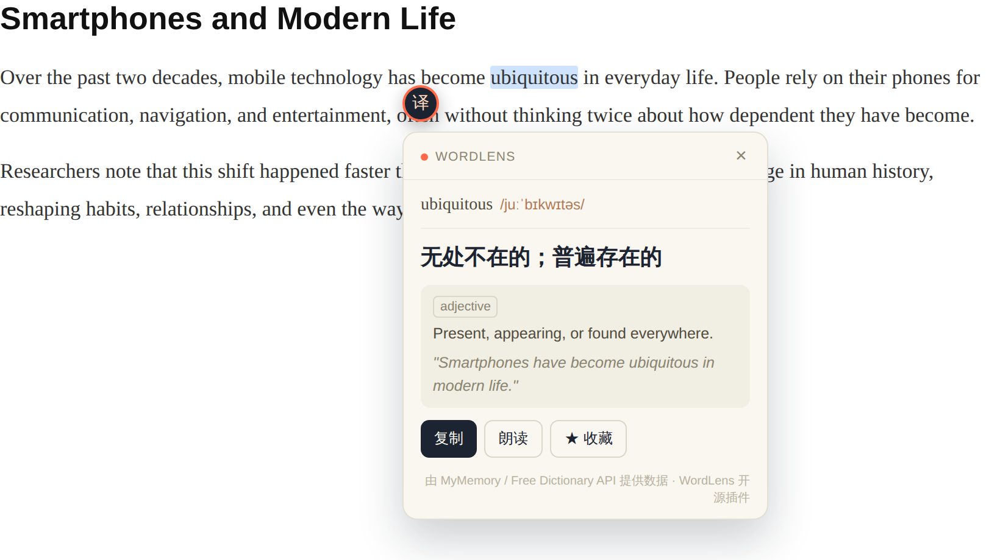

# WordLens 词镜 🔍

> 选中网页上的任意文字，立即弹出翻译卡片。零配置、轻量、完全开源。



WordLens 是一个浏览器插件：在任何网页上选中一段文字，会出现一个小按钮，点击后即可看到翻译结果、朗读发音，并一键复制。不需要跳转到翻译网站，不需要注册账号，不需要 API key。

## ✨ 功能

- 🖱️ **划词即译**：选中文字，点击小按钮，立刻看到翻译
- 📖 **英文词典模式**：选中单个英文单词时，自动附带音标、词性、释义和真实例句（数据来自 Free Dictionary API）
- 📓 **生词本**：点「★ 收藏」把查过的词存起来，随时在专门的生词本页面搜索、查看、删除
- 📤 **导出 Anki / CSV**：生词本一键导出成 Anki 桌面版可直接导入的格式，或导出 CSV 表格
- 🔊 **朗读发音**：基于浏览器原生 TTS，点一下就能听发音
- 📋 **一键复制**：复制翻译结果到剪贴板
- 🌐 **多目标语言**：中文 / English / 日本語 / 한국어 / Français / Español / Deutsch
- 🪶 **零依赖**：纯原生 JavaScript，没有任何打包/构建步骤
- 🔒 **隐私友好**：除了把你选中的文字发给翻译 / 词典 API 用于查询之外，不收集任何数据；生词本数据只存在你自己的浏览器本地

## 📦 安装（开发者模式）

目前还没有上架 Chrome Web Store，可以用"加载已解压的扩展程序"的方式安装：

1. 克隆或下载本仓库
2. 打开 Chrome / Edge，访问 `chrome://extensions`
3. 打开右上角的「开发者模式」
4. 点击「加载已解压的扩展程序」，选择本项目的文件夹
5. 在任意网页选中一段文字试试看！

## 🛠️ 工作原理

```
选中文字 (content.js)
      │
      ▼
显示触发按钮 → 点击
      │
      ▼
content.js 通过 chrome.runtime.sendMessage 把文字发给
      │
      ▼
background.js（service worker）请求 MyMemory 翻译 API
      │
      ▼
结果返回给 content.js，渲染进翻译卡片
```

- **`src/content.js`** — 注入到每个网页，检测划词选区，渲染 UI（用 Shadow DOM 隔离样式，不会影响宿主页面），并负责把收藏的生词写进 `chrome.storage.local`
- **`src/background.js`** — 后台 service worker，负责调用翻译 API 和词典 API（避免被某些网站的 CSP 拦截）
- **`src/popup.html/js/css`** — 点击插件图标看到的设置面板，也是打开生词本页面的入口
- **`src/vocab.html/js/css`** — 独立的生词本页面，负责展示 / 搜索 / 删除 / 导出已收藏的生词
- 翻译后端目前使用免费的 [MyMemory API](https://mymemory.translated.net/doc/spec.php)（无需 key，匿名用户每天约 5000 词额度）
- 英文词典数据使用免费的 [Free Dictionary API](https://dictionaryapi.dev/)（无需 key，仅支持单个英文单词）

## 🗺️ Roadmap / 欢迎贡献的方向

这些是已知的局限和欢迎大家一起完善的地方：

- [ ] 源语言检测目前是简单的字符集启发式判断（是否含日文假名/韩文/中文），可以换成更准确的语言检测库
- [ ] 支持切换翻译后端（DeepL / 腾讯翻译 / 自建 LibreTranslate），现在只接了 MyMemory
- [ ] Firefox 兼容（目前只测试过 Chrome / Edge，Manifest V3）
- [ ] 翻译卡片支持深色模式跟随系统
- [ ] 快捷键直接触发翻译（比如按住 Alt 选词），不用每次点按钮
- [ ] 支持配置网站黑名单，在某些网站（如 Google Docs、代码编辑器类网站）不触发
- [ ] 生词本支持按熟练度/标签分类，做成真正的间隔复习工具
- [ ] 发布到 Chrome Web Store

如果你想认领某一项，欢迎直接提 PR，或者先开个 issue 讨论思路。第一次给开源项目提 PR 也完全没问题，欢迎从小的修复开始。

## 🤝 贡献指南

1. Fork 本仓库，新建一个分支
2. 本地用「加载已解压的扩展程序」的方式调试（改完代码后在 `chrome://extensions` 点刷新即可，不需要编译）
3. 提交 PR，描述清楚改了什么、为什么改

代码风格上没有特别严格的要求，保持现有文件的命名/结构习惯即可。

## 📄 License

[MIT](./LICENSE) — 你可以自由使用、修改、再发布。
